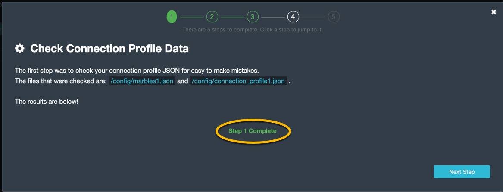
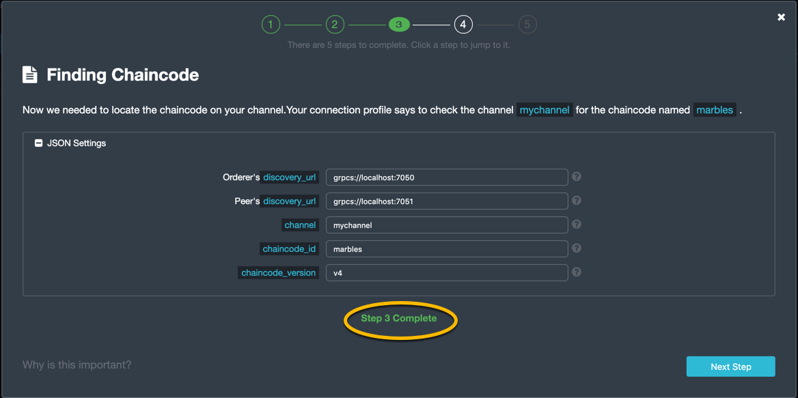
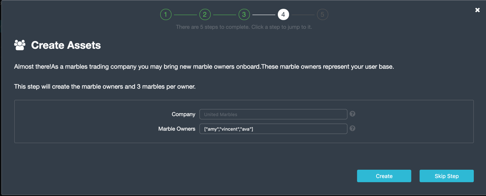
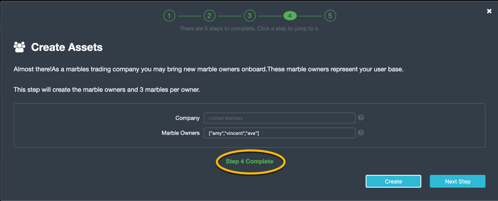
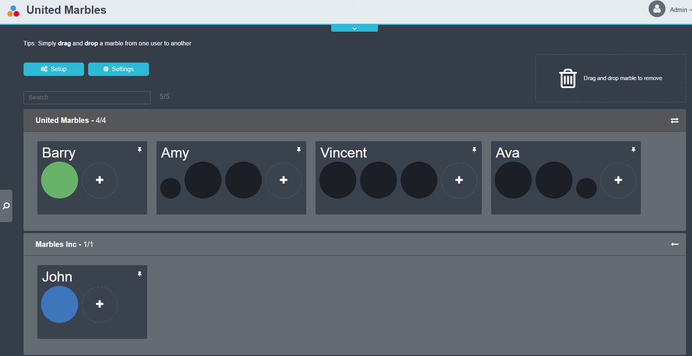
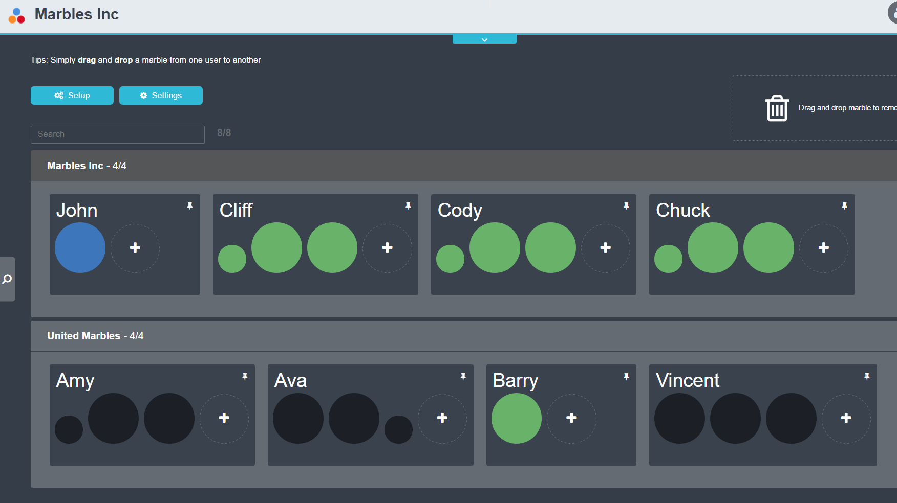
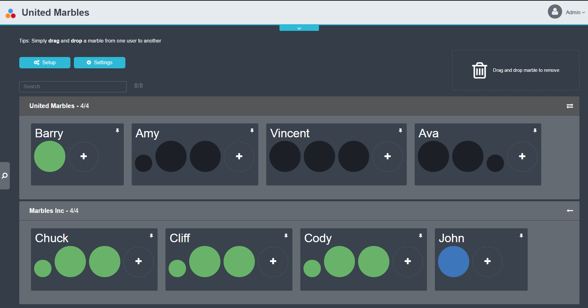

Section 1: Lab Part 2 Overview
==============================

In this part of the lab, you will use the Hyperledger Fabric network that you
created in the Part 1 of the lab and configure the Marbles User Interface
(UI) web application so that it will integrate with the marbles
chaincode that you installed in the previous lab.

You will use two browser sessions to simulate acting as a user for each
of the two organizations in the network- *United Marbles* and *Marbles
Inc*.

Then you can explore the Marbles UI to execute chaincode transactions
and see some of the Hyperledger Fabric concepts in action.

Section 2: Marbles user interface setup
=======================================

**Step 2.1:** Switch to the *~/zmarbles/marblesUI* directory:

    bcuser@ubuntu16045:~$ cd ~/zmarbles/marblesUI
    bcuser@ubuntu16045:~/zmarbles/marblesUI$ 

**Step 2.2:** You will need to do an *npm install* to install the
packages needed by the Marbles user interface. First you will verify
that the *node\_modules* directory does not exist. This directory will
be created when you run an npm *install* in the next step, so right now
it shouldn't exist:

    bcuser@ubuntu16045:~/zmarbles/marblesUI$ ls -l node_modules
    ls: cannot access 'node_modules': No such file or directory

**Step 2.3:** Now run the *npm install*:

    bcuser@ubuntu16045:~/zmarbles/marblesUI$ npm install
      .
      .  (output not shown here)
      .

**Step 2.4:** When this command ends, list the *node\_modules* directory
again. It is there now:

    bcuser@ubuntu16045:~/zmarbles/marblesUI$ ls -l node_modules
      .
      .  (output not shown here)
      .

**Step 2.5:** Change to the *config* directory:

    bcuser@ubuntu16045:~/zmarbles/marblesUI$ cd config
    bcuser@ubuntu16045;~/zmarbles/marblesUI/config$ 

**Step 2.6:** There are four files in this directory:

    bcuser@ubuntu16045:~/zmarbles/marblesUI/config$ ls
    connection_profile1.json  connection_profile2.json  marbles1.json  marbles2.json
    bcuser@ubuntu16045:~/zmarbles/marblesUI/config$ 

**Step 2.7:** There are two files for the first fictitious company,
*United Marbles*, and two files for the second fictitious company,
*Marbles Inc.* Look at the *marbles1.json* file with the *cat* command:

    bcuser@ubuntu16045:~/zmarbles/marblesUI/config$ cat marbles1.json 
    {
       "cred_filename": "connection_profile1.json",
       "use_events": false,
       "keep_alive_secs": 120,
       "company": "United Marbles",
       "usernames": [
           "amy",
           "alice",
           "ava"
       ],
       "port": 3001,
       "last_startup_hash": ""
    }

**Step 2.8:** Notice that this file points to one of the other existing
files, *connection\_profile1.json*, as the value of the *cred\_filename*
name/value pair. You will look at that in a moment. Take a note of the
usernames array- *amy*, *alice*, and *ava*. If you are comfortable with
the *vi* editor you could change those names to your favorite names if
you would like. You can also use the *sed* command to change the name
inline without entering *vi*. Here is an example of a command to change
the name *alice* to *vincent*. **This step is optional- you do not have
to do this is you prefer the name alice to vincent**:

    bcuser@ubuntu16045:~/zmarbles/marblesUI/config$ sed -i "s/alice/vincent/" marbles1.json   # optional
    bcuser@ubuntu16045:~/zmarbles/marblesUI/config$

**Step 2.9:** Here is the file after I changed *alice* to *vincent* with
the previous sed command:

    bcuser@ubuntu16045:~/zmarbles/marblesUI/config$ cat marbles1.json 
    {
       "cred_filename": "connection_profile1.json",
       "use_events": false,
       "keep_alive_secs": 120,
       "company": "United Marbles",
       "usernames": [
           "amy",
           "vincent",
           "ava"
       ],
       "port": 3001,
       "last_startup_hash": ""
    }

**NOTE:** Your file will look different if you choose to skip the
optional *Step 2.9* or if you made changes other than the example change
I showed. The purpose of this step is to ensure that your file changed
the way you intended it to (if it changed at all).

The other key thing to note is the port number. It is *3001* here. In
the *marbles2.json* file for *Marbles Inc*, port *3002* will be
specified. This is how, later in this lab, you will pretend to be a user
of one company or the other- by using port 3001 in the URL to pretend to
be a "United Marbles" user and by using port 3002 in the URL to pretend
to be a "Marbles Inc" user.

**Step 2.10:** It is time to look at the main configuration file the
Marbles app uses. It is the file specified as the *cred\_filename* value
in the *marbles1.json* file. This name *cred\_filename* for the JSON
name/value pair and the filename, *blockchain\_creds1.json*, indicate
that security credentials are specified in this file, and they are, but
actually information about the Hyperledger Fabric network itself is
specified in this file as well. This file is too large to fit in one
screen, so I will teach you one more Linux command, named *more*. (Pun
intended). Type this:

    bcuser@ubuntu16045:~/zmarbles/marblesUI/config$ more connection_profile1.json

This command will print as much of the file as it can on your screen but
will pause until you hit enter before displaying the rest of the file's
contents. Here are the complete contents of this file:

    {
       "name": "Docker Compose Network",
       "x-networkId": "not-important",
       "x-type": "hlfv1",
       "description": "Connection Profile for an IBM Blockchain Network",
       "version": "1.0.0",
       "client": {
           "organization": "Org0MSP"
       },
       "channels": {
           "mychannel": {
               "orderers": [
                   "fabric-orderer"
               ],
               "peers": {  
                   "fabric-peer-org1" : {
                                       "x-chaincode": {}
                                    }
               },
               "chaincodes": [
                   "marbles:v4"
               ],
               "x-blockDelay": 1000
           }
       },
       "organizations": {
           "Org0MSP": {
               "mspid": "Org0MSP",
               "peers": [
                   "fabric-peer-org1"
               ],
               "certificateAuthorities": [
                   "fabric-ca-org1"
               ]
           }
       },
       "orderers": {
           "fabric-orderer": {
               "url": "grpcs://localhost:7050",
               "grpcOptions": {
                   "ssl-target-name-override": "orderer.blockchain.com",
                   "grpc.http2.keepalive_time": 300,
                   "grpc.keepalive_time_ms": 300000,
                   "grpc.http2.keepalive_timeout": 35,
                   "grpc.keepalive_timeout_ms": 3500
               },
               "tlsCACerts": {
                   "path": "../../crypto-config/ordererOrganizations/blockchain.com/orderers/orderer.blockchain.com/tls/ca.crt"
               }
           }

       },
       "peers": {
           "fabric-peer-org1": {
               "url": "grpcs://localhost:7051",
               "eventUrl": "grpcs://localhost:7053",
               "grpcOptions": {
                   "ssl-target-name-override": "peer0.unitedmarbles.com",
                   "grpc.http2.keepalive_time": 300,
                   "grpc.keepalive_time_ms": 300000,
                   "grpc.http2.keepalive_timeout": 35,
                   "grpc.keepalive_timeout_ms": 3500
               },
               "tlsCACerts": {
                   "path": "../../crypto-config/peerOrganizations/unitedmarbles.com/peers/peer0.unitedmarbles.com/tls/ca.crt"
               }
           }
       },
       "certificateAuthorities": {
           "fabric-ca-org1": {
               "url": "https://localhost:7054",
               "httpOptions": {
                   "ssl-target-name-override": "ca.unitedmarbles.com",
                   "verify": true
               },
               "tlsCACerts": {
                   "path": "../../crypto-config/peerOrganizations/unitedmarbles.com/ca/ca.unitedmarbles.com-cert.pem"
               },
               "registrar": [
                   {
                       "enrollId": "admin",
                       "enrollSecret": "adminpw"
                   }
               ],
               "caName": "ca-org0"
           }
       }
    }

This is a standard Hyperledger Fabric connection profile. This lab does
not use Hyperledger Composer, but I think the Hyperledger Composer team
did a nice job describing Hyperledger Fabric connection profiles, as
they use them too. See
<https://hyperledger.github.io/composer/latest/reference/connectionprofile>
for their description. They also reference a link in the Hyperledger
Fabric Node.js SDK documentation at
<https://fabric-sdk-node.github.io/tutorial-network-config.html> which
is a little more advanced, and it describes the profile in YAML form
versus the JSON form that this Marbles demo app uses.

**IMPORTANT: if you used a channel name other than the default of
mychannel, you must change this value from mychannel to the value you
used.** Either use the *vi* editor if you are comfortable with that, or,
you could use *sed*. For example, here is a *sed* command, to change the
channel name from *mychannel* to *tim*, along with "before" and "after"
*grep* commands to show the changes **(These commands are examples and
only needed if you did not use the default channel name of mychannel)**

!!! warning
        This step is necessary only if you did not use this lab's default channel name of *mychannel*
        earlier in Part 1 of this lab. And of course, this example shows the steps for changing the
        channel name to *tim*, so tailor the command shown here according to whatever *non-default* 
        channel name you may have chosen.
```

    bcuser@ubuntu16045:~/zmarbles/marblesUI/config$ grep mychannel connection_profile[12].json 
    blockchain_creds1.json:            "channel_id": "mychannel",
    blockchain_creds2.json:            "channel_id": "mychannel", 
    bcuser@ubuntu16045:~/zmarbles/marblesUI/config$ sed -i "s/mychannel/tim/" connection_profile[12].json 
    bcuser@ubuntu16045:~/zmarbles/marblesUI/config$ grep -1 channels connection_profile[12].json 
    connection_profile1.json-  },
    connection_profile1.json:  "channels": {
    connection_profile1.json-      "tim": {
    --
    connection_profile2.json-  },
    connection_profile2.json:  "channels": {
    connection_profile2.json-      "tim": {

```

**Step 2.11:** The considerations for *marbles2.json* and
*connection\_profile2.json* are the same as for *marbles1.json* and
*connection\_profile1.json* except that they apply to "Marbles Inc."
instead of "United Marbles". If you would like to compare the
differences between *connection\_profile1.json* and
*connection\_profile2.json*, try the *diff* command and observe its
output. This command lists sections of the two files that it finds
different. The lines from the first file, *blockchain\_creds1.json*,
start with '<' (added by the diff command output, not in the actual
file), and the lines from the second file, *blockchain\_creds2.json*,
start with '\>':

    bcuser@ubuntu16045:~/zmarbles/marblesUI/config$ diff connection_profile1.json connection_profile2.json 
    8c8
    <      "organization": "Org0MSP"
    ---
    >      "organization": "Org1MSP"
    16c16
    <                  "fabric-peer-org1" : {
    ---
    >                  "fabric-peer-org2" : {
    27,28c27,28
    <      "Org0MSP": {
    <          "mspid": "Org0MSP",
    ---
    >      "Org1MSP": {
    >          "mspid": "Org1MSP",
    30c30
    <              "fabric-peer-org1"
    ---
    >              "fabric-peer-org2"
    33c33
    <              "fabric-ca-org1"
    ---
    >              "fabric-ca-org2"
    54,56c54,56
    <      "fabric-peer-org1": {
    <          "url": "grpcs://localhost:7051",
    <          "eventUrl": "grpcs://localhost:7053",
    ---
    >      "fabric-peer-org2": {
    >          "url": "grpcs://localhost:9051",
    >          "eventUrl": "grpcs://localhost:9053",
    58c58
    <              "ssl-target-name-override": "peer0.unitedmarbles.com",
    ---
    >              "ssl-target-name-override": "peer0.marblesinc.com",
    65c65
    <              "path": "../../crypto-config/peerOrganizations/unitedmarbles.com/peers/peer0.unitedmarbles.com/tls/ca.crt"
    ---
    >              "path": "../../crypto-config/peerOrganizations/marblesinc.com/peers/peer0.marblesinc.com/tls/ca.crt"
    70,71c70,71
    <      "fabric-ca-org1": {
    <          "url": "https://localhost:7054",
    ---
    >      "fabric-ca-org2": {
    >          "url": "https://localhost:8054",
    73c73
    <              "ssl-target-name-override": "ca.unitedmarbles.com",
    ---
    >              "ssl-target-name-override": "ca.marblesinc.com",
    77c77
    <              "path": "../../crypto-config/peerOrganizations/unitedmarbles.com/ca/ca.unitedmarbles.com-cert.pem"
    ---
    >              "path": "../../crypto-config/peerOrganizations/marblesinc.com/ca/ca.marblesinc.com-cert.pem"
    81,82c81,82
    <                  "enrollId": "admin",
    <                  "enrollSecret": "adminpw"
    ---
    >                  "enrollId": "admin2",
    >                  "enrollSecret": "adminpw2"
    85c85
    <          "caName": "ca-org0"
    ---
    >          "caName": "ca-org1"

Section 3: Start the Marbles user interface
===========================================

In this section, you will use the Marbles user interface. You will start
two browser sessions- one will be as a "United Marbles" user, and the
other as a "Marbles Inc" user. Here in this lab, you are serving both
companies' applications from the same server, so you will differentiate
between the two companies by the port number. You will connect to port
3001 when acting as a United Marbles user, and you will connect to port
3002 when acting as a Marbles Inc user. In the real world, each of the
two companies would probably either serve the user interface from their
own server, or perhaps both companies would log in to a server provided
by a service provider- think "Blockchain-as-a-service". The chosen
topology is use-case dependent and beyond the scope of this lab.

**Step 3.1:** You are now ready to start the server for UnitedMarbles.
Back up to the *~/zmarbles/marblesUI* directory:

    bcuser@ubuntu16045:~/zmarbles/marblesUI/config$ cd ..
    bcuser@ubuntu16045:~/zmarbles/marblesUI$

**Step 3.2:** You will now use *gulp* to start up the server, with this
command:

    bcuser@ubuntu16045:~/zmarbles/marblesUI$ gulp marbles1
    [12:58:04] Using gulpfile ~/zmarbles/marblesUI/gulpfile.js
    [12:58:04] Starting 'env_tls'...
    [12:58:04] Finished 'env_tls' after 52 μs
    [12:58:04] Starting 'build-sass'...
    [12:58:04] Finished 'build-sass' after 6.47 ms
    [12:58:04] Starting 'watch-sass'...
    [12:58:04] Finished 'watch-sass' after 6.58 ms
    [12:58:04] Starting 'watch-server'...
    [12:58:04] Finished 'watch-server' after 1.96 ms
    [12:58:04] Starting 'server'...
    info: Checking connection profile is done
    info: Loaded config file /home/bcuser/zmarbles/marblesUI/config/marbles1.json
    info: Loaded connection profile file /home/bcuser/zmarbles/marblesUI/config/connection_profile1.json


    Connection Profile Lib Functions:()
      getNetworkName()
      getNetworkCredFileName()
      buildTlsOpts()
      getFirstChannelId()
      getChannelId()
      loadPem()
      getMarblesField()
      getChaincodeId()
      getChaincodeVersion()
      getFirstCaName()
      getCA()
      getCasUrl()
      getAllCaUrls()
      getCaName()
      getCaTlsCertOpts()
      getEnrollObj()
      getFirstPeerName()
      getPeer()
      getPeersUrl()
      getAllPeerUrls()
      getPeerEventUrl()
      getPeerTlsCertOpts()
      getMarbleUsernamesConfig()
      getCompanyNameFromFile()
      getMarblesPort()
      getEventsSetting()
      getKeepAliveMs()
      getFirstOrdererName()
      getOrderer()
      getOrderersUrl()
      getOrdererTlsCertOpts()
      getBlockDelay()
      getKvsPath()
      getFirstOrg()
      getClientsOrgName()
      getClientOrg()
      getMarbleUsernames()
      getOrgsMSPid()
      getAdminPrivateKeyPEM()
      getAdminSignedCertPEM()


    ----------------------------------- Server Up - localhost:3001 -----------------------------------
    Welcome aboard:     United Marbles
    Channel:    mychannel
    Org:        Org0MSP
    CA:         fabric-ca-org1
    Orderer:    fabric-orderer
    Peer:       fabric-peer-org1
    Chaincode ID:   marbles
    Chaincode Version:  v4
    ------------------------------------------ Websocket Up ------------------------------------------


    debug: loading pem from a path: /home/bcuser/zmarbles/crypto-config/peerOrganizations/unitedmarbles.com /ca/ca.unitedmarbles.com-cert.pem
    debug: loading pem from a path: /home/bcuser/zmarbles/crypto-config/ordererOrganizations/blockchain.com/orderers/orderer.blockchain.com/tls/ca.crt
    debug: loading pem from a path: /home/bcuser/zmarbles/crypto-config/peerOrganizations/unitedmarbles.com/peers/peer0.unitedmarbles.com/tls/ca.crt
    info: [fcw] Going to enroll peer_urls=[grpcs://localhost:7051], channel_id=mychannel, uuid=marblesDockerComposeNetworkmychannelOrg0MSPfabricpeerorg1, ca_url=https://localhost:7054, orderer_url=grpcs://localhost:7050, enroll_id=admin, enroll_secret=adminpw, msp_id=Org0MSP, kvs_path=/home/bcuser/.hfc-key-store/marblesDockerComposeNetworkmychannelOrg0MSPfabricpeerorg1
    debug: enroll id: "admin", secret: "adminpw"
    debug: msp_id:  Org0MSP ca_name: ca-org0
    info: [fcw] Successfully enrolled user 'admin'
    debug: added peer grpcs://localhost:7051
    debug: [fcw] Successfully got enrollment marblesDockerComposeNetworkmychannelOrg0MSPfabricpeerorg1
    info: Success enrolling admin
    debug: loading pem from a path: /home/bcuser/zmarbles/crypto-config/peerOrganizations/unitedmarbles.com/ca/ca.unitedmarbles.com-cert.pem
    debug: loading pem from a path: /home/bcuser/zmarbles/crypto-config/ordererOrganizations/blockchain.com/orderers/orderer.blockchain.com/tls/ca.crt
    debug: loading pem from a path: /home/bcuser/zmarbles/crypto-config/peerOrganizations/unitedmarbles.com/peers/peer0.unitedmarbles.com/tls/ca.crt
    debug: Checking if chaincode is already instantiated or not 1

    info: Checking for chaincode...
    debug: [fcw] Querying Chaincode: read()
    debug: [fcw] Sending query req: chaincodeId=marbles, fcn=read, args=[selftest], txId=null
    debug: [fcw] Peer Query Response - len: 1 type: number
    debug: [fcw] Successful query transaction.

    ----------------------------- Chaincode found on channel "mychannel" -----------------------------


    info: Checking chaincode and ui compatibility...
    debug: [fcw] Querying Chaincode: read()
    debug: [fcw] Sending query req: chaincodeId=marbles, fcn=read, args=[marbles_ui], txId=null
    warn: [fcw] warning - query resp is not json, might be okay: string 4.0.1
    debug: [fcw] Successful query transaction.
    info: Chaincode version is good
    info: Checking ledger for marble owners listed in the config file

    info: Fetching EVERYTHING...
    debug: [fcw] Querying Chaincode: read_everything()
    debug: [fcw] Sending query req: chaincodeId=marbles, fcn=read_everything, args=[], txId=null
    debug: [fcw] Peer Query Response - len: 529 type: object
    debug: [fcw] Successful query transaction.
    debug: This company has registered marble owners
    debug: Looking for marble owner: amy
    debug: Did not find marble username: amy
    info: We need to make marble owners


    - - - - - - - - - - - - - - - - - - - - - - - - - - - - - - - - - -
    info: Detected that we have NOT launched successfully yet
    debug: Open your browser to http://localhost:3001 and login as "admin" to initiate startup
    - - - - - - - - - - - - - - - - - - - - - - - - - - - - - - - - - -

The first line of the output just listed reads:

    [12:58:04] Using gulpfile ~/zmarbles/marblesUI/gulpfile.js

I am not going to go into detail on the *gulp* tool here, but if you are
curious, if you look into the *gulpfile.js* file (you would have to use
another PuTTY or SSH session as this one is now tied up) you would find
that a *marbles1* task (*marbles1* being your argument to the *gulp*
command) is defined:

    gulp.task('marbles1', ['env_tls', 'watch-sass', 'watch-server', 'server']);

The *marbles1* task specifies four more tasks to run, the first of which
is *env\_tls*. This task is adding a value to a map named *env*. This
value points to the *marbles1.json* file:

    gulp.task('env_tls', function () {
           env['creds_filename'] = 'marbles1.json';
    });

The last of the tasks, *server*, when it is started, is receiving this
map named *env* as part of its invocation:

    gulp.task('server', function(a, b) {
            if(node) node.kill();
            node = spawn('node', ['app.js'], {env: env, stdio: 'inherit'}); //command, file, options
    });

The syntax is a bit arcane, and this is not a course in JavaScript, but
there is a line in the main file for the server, *app.js*, that reads
this *creds\_filename* value:

    var cp = require(__dirname + '/utils/connection_profile_lib/index.js')(process.env.creds_filename, logger);

Then within *utils/connection\_profile\_lib/index.js* is where all the
magic, a.k.a. code, happens to make use of the values specified in that
file.

You did not need to know all this to run the application, but you might
need to know where to start looking when your boss asks you to tailor
the marbles application because she wants a return on the time and money
you spent taking this lab- assuming you don't get off the hook when you
tell her that nowhere was JavaScript mentioned on the agenda.

**Step 3.3:** Open up a web browser window or tab and point to
*http://<your\_IP\_goes\_here\>:3001*. Substitute your team's assigned 
IP address instead of *<your\_IP\_goes\_here\>*. 
You should see a window pop up that looks like this:


**Step 3.4:** You are given a choice between *Express* and *Guided* for
setting up the demo. Don't short-change yourself- pick *Guided*,
you'll learn more. After you click *Guided*, you will see this:



Read the text in the window to see what's going on.

**Step 3.5:** If you do not see *Step 1 Complete*, ask an instructor for
help. Otherwise, click *Next Step* and you should see this:


Click the '+' sign if you wish to see the settings used to contact the
Fabric Certificate Authority.

**Step 3.6:** If you do not see *Step 2 Complete*, ask an instructor for
help. Otherwise, click *Next Step* and you should see this:



Click the '+' sign to see information about your environment and your
marbles chaincode.

**Step 3.7:** If you do not see *Step 3 Complete*, ask an instructor for
help. Otherwise, click *Next Step* and you should see this:



**Step 3.8:** Unlike the first three steps, which did not require
further input from you to complete, this step will not proceed until you
click the *Create* button. Before you do that you have an opportunity to
review and change the names that you use for new marbles owners in
addition to the owner named 'Barry' that should already exist (though
not evident from this screen) if you created it in the first part of
this lab.

Click the *Create* button when you are ready and after several seconds
you should see *Step 4 Complete* on the screen:



**Step 3.9:** If you do not see *Step 4 Complete*, ask an instructor for
help. Otherwise, click *Next Step* and you should see this:


This should just give you a smiley face and a message saying that setup
is complete.

**Step 3.10:** Click *Enter* and you should be returned to a screen that
looks similar to this (your names may differ):



**Step 3.11:** What about John's marble for Marbles Inc.? You only
started up the server for United Marbles, so why does Marbles Inc show
up and why is John so lonely? When you did the previous lab, the first
two commands I had you do were an *init\_owner* for John, tying him to
Marbles Inc, and then an *init\_marble*, giving him a marble. Remember,
the "blockchain" is shared among all participants of the channel, so
United Marbles and Marbles Inc both see the same chain- they see each
other's marbles.

But the user names specified in *config/marbles2.json* are not created
until you start the server for *marbles2* and log in the first time.
List the contents of *marbles2.json* file (switch to a free PuTTY
session or start a new one), e.g.:

    bcuser@ubuntu16045:~$ cd ~/zmarbles/marblesUI
    bcuser@ubuntu16045:~/zmarbles/marblesUI$ cat config/marbles2.json 
    {
        "cred_filename": "connection_profile2.json",
        "use_events": false,
        "keep_alive_secs": 120,
        "company": "Marbles Inc",
        "usernames": [
            "cliff",
            "cody",
            "chuck"
        ],
        "port": 3002,
        "last_startup_hash": ""
    }

**Step 3.12:** Start the second server, the one for Marbles Inc:

    bcuser@ubuntu16045:~/zmarbles/marblesUI$ gulp marbles2
    [13:12:59] Using gulpfile ~/zmarbles/marblesUI/gulpfile.js
    [13:12:59] Starting 'env_tls2'...
    [13:12:59] Finished 'env_tls2' after 54 μs
    [13:12:59] Starting 'build-sass'...
    [13:12:59] Finished 'build-sass' after 6.6 ms
    [13:12:59] Starting 'watch-sass'...
    [13:12:59] Finished 'watch-sass' after 7.13 ms
    [13:12:59] Starting 'watch-server'...
    [13:12:59] Finished 'watch-server' after 1.94 ms
    [13:12:59] Starting 'server'...
    info: Checking connection profile is done
    info: Loaded config file /home/bcuser/zmarbles/marblesUI/config/marbles2.json
    info: Loaded connection profile file /home/bcuser/zmarbles/marblesUI/config/connection_profile2.json


    Connection Profile Lib Functions:()
      getNetworkName()
      getNetworkCredFileName()
      buildTlsOpts()
      getFirstChannelId()
      getChannelId()
      loadPem()
      getMarblesField()
      getChaincodeId()
      getChaincodeVersion()
      getFirstCaName()
      getCA()
      getCasUrl()
      getAllCaUrls()
      getCaName()
      getCaTlsCertOpts()
      getEnrollObj()
      getFirstPeerName()
      getPeer()
      getPeersUrl()
      getAllPeerUrls()
      getPeerEventUrl()
      getPeerTlsCertOpts()
      getMarbleUsernamesConfig()
      getCompanyNameFromFile() 
      getMarblesPort()
      getEventsSetting()
      getKeepAliveMs()
      getFirstOrdererName()
      getOrderer()
      getOrderersUrl()
      getOrdererTlsCertOpts()
      getBlockDelay()
      getKvsPath()
      getFirstOrg()
      getClientsOrgName()
      getClientOrg()
      getMarbleUsernames()
      getOrgsMSPid()
      getAdminPrivateKeyPEM()
      getAdminSignedCertPEM()


    ----------------------------------- Server Up - localhost:3002 -----------------------------------
    Welcome aboard:     Marbles Inc
    Channel:    mychannel
    Org:        Org1MSP
    CA:         fabric-ca-org2
    Orderer:    fabric-orderer
    Peer:       fabric-peer-org2
    Chaincode ID:   marbles
    Chaincode Version:  v4
    ------------------------------------------ Websocket Up ------------------------------------------


    debug: loading pem from a path: /home/bcuser/zmarbles/crypto-config/peerOrganizations/marblesinc.com/ca/ca.marblesinc.com-cert.pem
    debug: loading pem from a path: /home/bcuser/zmarbles/crypto-config/ordererOrganizations/blockchain.com/orderers/orderer.blockchain.com/tls/ca.crt
    debug: loading pem from a path: /home/bcuser/zmarbles/crypto-config/peerOrganizations/marblesinc.com/peers/peer0.marblesinc.com/tls/ca.crt
    info: [fcw] Going to enroll peer_urls=[grpcs://localhost:9051], channel_id=mychannel, uuid=marblesDockerComposeNetworkmychannelOrg1MSPfabricpeerorg2, ca_url=https://localhost:8054, orderer_url=grpcs://localhost:7050, enroll_id=admin2, enroll_secret=adminpw2, msp_id=Org1MSP, kvs_path=/home/bcuser/.hfc-key-store/marblesDockerComposeNetworkmychannelOrg1MSPfabricpeerorg2
    debug: enroll id: "admin2", secret: "adminpw2"
    debug: msp_id:  Org1MSP ca_name: ca-org1
    info: [fcw] Successfully enrolled user 'admin2'
    debug: added peer grpcs://localhost:9051
    debug: [fcw] Successfully got enrollment marblesDockerComposeNetworkmychannelOrg1MSPfabricpeerorg2
    info: Success enrolling admin
    debug: loading pem from a path: /home/bcuser/zmarbles/crypto-config/peerOrganizations/marblesinc.com/ca/ca.marblesinc.com-cert.pem
    debug: loading pem from a path: /home/bcuser/zmarbles/crypto-config/ordererOrganizations/blockchain.com/orderers/orderer.blockchain.com/tls/ca.crt
    debug: loading pem from a path: /home/bcuser/zmarbles/crypto-config/peerOrganizations/marblesinc.com/peers/peer0.marblesinc.com/tls/ca.crt
    debug: Checking if chaincode is already instantiated or not 1

    info: Checking for chaincode...
    debug: [fcw] Querying Chaincode: read()
    debug: [fcw] Sending query req: chaincodeId=marbles, fcn=read, args=[selftest], txId=null
    debug: [fcw] Peer Query Response - len: 1 type: number
    debug: [fcw] Successful query transaction.

    ----------------------------- Chaincode found on channel "mychannel" -----------------------------


    info: Checking chaincode and ui compatibility...
    debug: [fcw] Querying Chaincode: read()
    debug: [fcw] Sending query req: chaincodeId=marbles, fcn=read, args=[marbles_ui], txId=null
    warn: [fcw] warning - query resp is not json, might be okay: string 4.0.1
    debug: [fcw] Successful query transaction.
    info: Chaincode version is good
    info: Checking ledger for marble owners listed in the config file

    info: Fetching EVERYTHING...
    debug: [fcw] Querying Chaincode: read_everything()
    debug: [fcw] Sending query req: chaincodeId=marbles, fcn=read_everything, args=[], txId=null
    debug: [fcw] Peer Query Response - len: 2282 type: object
    debug: [fcw] Successful query transaction.
    debug: This company has registered marble owners
    debug: Looking for marble owner: cliff
    debug: Did not find marble username: cliff
    info: We need to make marble owners


    - - - - - - - - - - - - - - - - - - - - - - - - - - - - - - - - - -
    info: Detected that we have NOT launched successfully yet
    debug: Open your browser to http://localhost:3002 and login as "admin" to initiate startup
    - - - - - - - - - - - - - - - - - - - - - - - - - - - - - - - - - -

If you peek at your browser session from United Marbles, (port 3001),
you will not notice any changes yet.

**Step 3.13:** Open a browser tab or window and navigate to
*http://<your\_IP\_here\>:3002*. You will again be given a choice of
*Express* or *Guided* and feel free to choose whichever path suits your
fancy. If you choose *Express*, everything should hopefully sail through
until you see a screen with all Marbles Inc. owners and marbles, as well
as all United Marbles owners and marbles:



**Step 3.14:** If you go back to your screen for United Marbles (port
3001) you should observe that it has been updated to show the owners and
marbles for Marbles Inc. in addition to United Marbles' own owners and
marbles:



Remember, you are looking at the United Marbles session but you see all
the new users and marbles created by the Marbles Inc administrator.

**Step 3.15:** Play with your marbles!! Here are some things you can do.
When you do things as one user, e.g. as the United Marbles admin, go to
the other user's screen to see that the changes one organization makes
are visible to the other organization:

-   On two different browser sessions, you should be logged in as the
    administrator for each of the two fictitious companies. When you are
    the United Marbles administrator, you can create marbles for you or
    anybody in United Marbles. You can delete marbles for you or anybody
    in United Marbles. You can take marbles from anybody in United
    Marbles and give them to anybody in the network, even to Marbles Inc
    people. (And vice versa when you are a Marbles Inc administrator).
-   Try clicking on the little magnifying glass to the left of the
    browser window and follow the directions
-   Right click on a marble (Hint: this is the same as using the
    magnifying glass)
-   Click on the **Settings** button and **Enable** story mode. Try an
    action that is allowed, and try an action that shouldn't be allowed,
    such as trying to steal a marble from the other company. **Disable**
    story mode when it gets too tedious, which shouldn't take long.

**Step 3.16:** If you want that extra rush, try these optional advanced
assignments:

-   Break out the previous lab's material and enter the *cli* container
    and issue some commands to create, update or delete marbles. See if
    the Marbles UI reflects your changes
-   Look at some of the marbles chaincode container logs while you work
    with the Marbles UI - **Hint:** *docker logs \[-f\] container\_name*
    will show a container's log. Try it without the optional *-f*
    argument first and then try it with it. *-f* ties up your terminal
    session but then shows new log messages as they are created. Press
    **Ctrl-c** to get out of it.
-   Look at the peer or orderer logs while you work with the Marbles UI

\* Click the **Start Up Help** button in the upper left in the Marbles
UI and then number *4* in the window that pops up. Edit the list of
names at the bottom and click **Create**. Do your new users show up in
both companies' sessions? What happens if you add a name that exists
already? 

**End of lab!**
