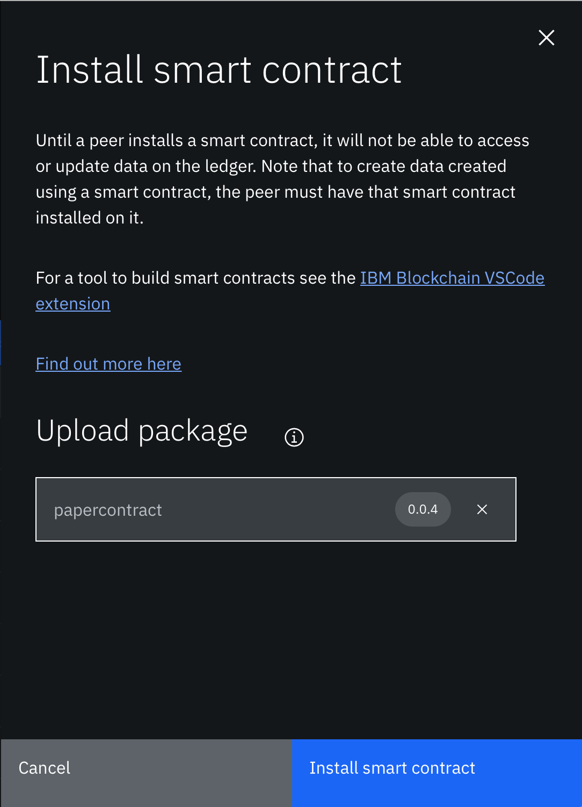
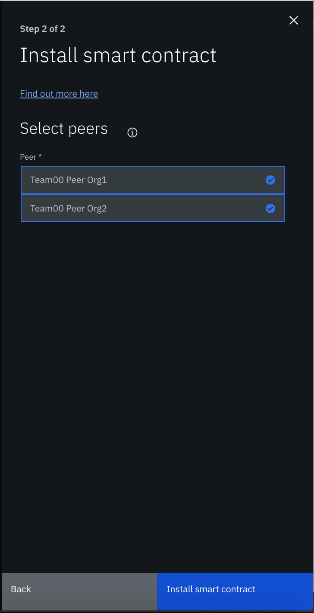
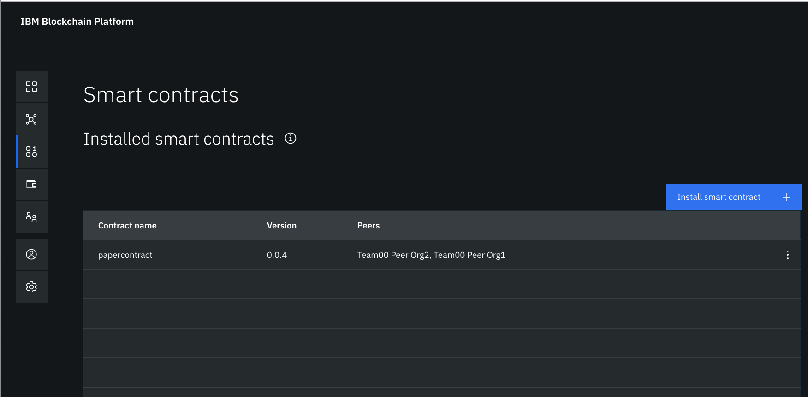
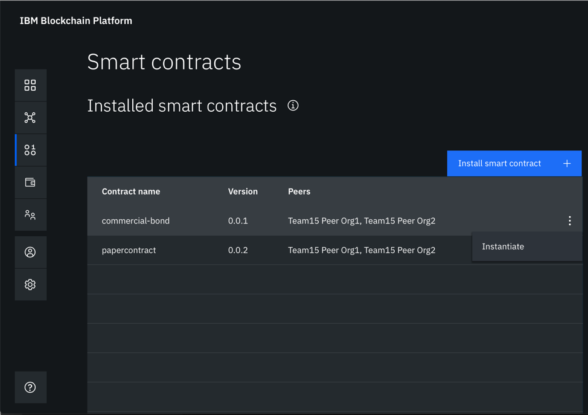
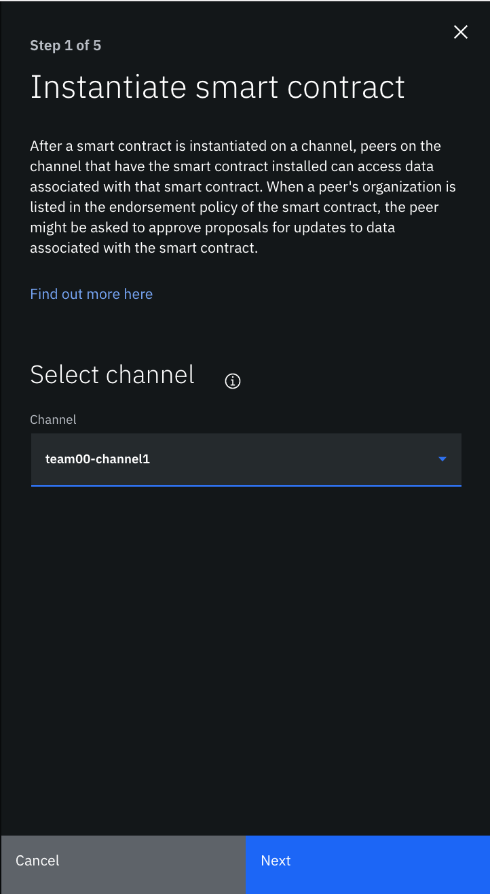
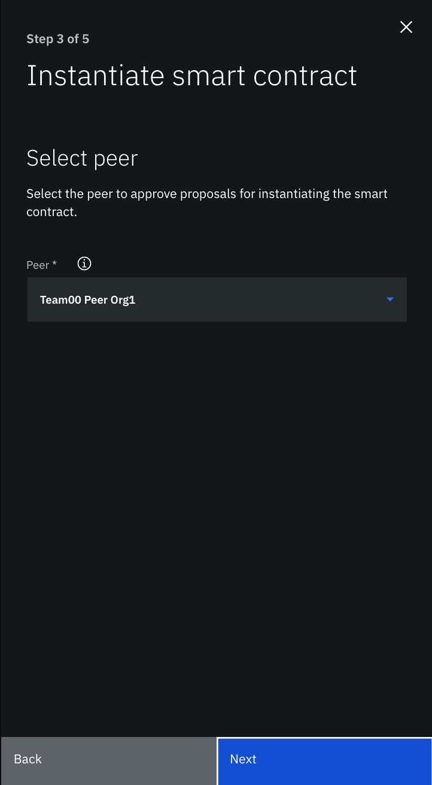
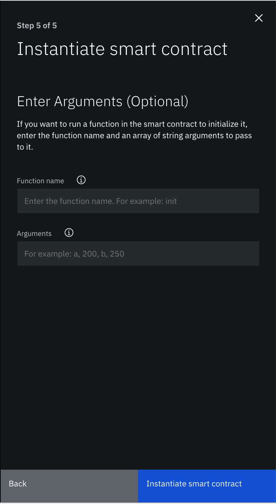
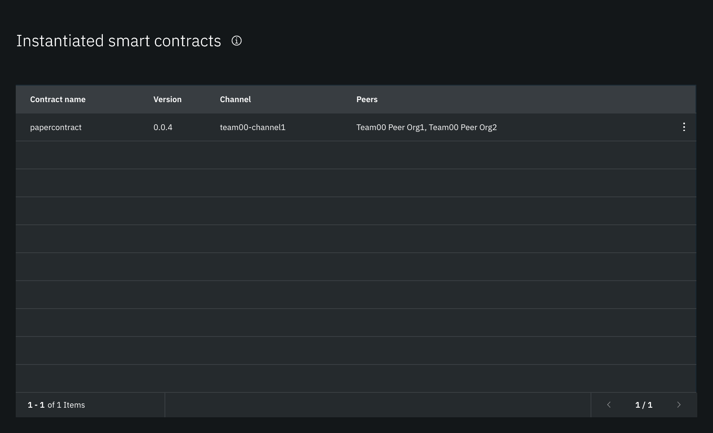

# IBM Blockchain Platform for Multicloud Part 2 - Deploying a Smart Contract

This lab will walk you through deploying the smart contracts that you worked with from the VSCode labs: namely `commercial-bond` and `commercial-paper`. This lab assumes that you have successfully completed the [IBM Blockchain Platform for Multicloud Part 1 - Deploying a blockchain network lab](ibpconsole.md). If you have not completed part 1, you must do so before continuing with this lab.

## Section 1: Export Commercial Paper and Commercial Bond

Remember from the VSCode labs, you have already packaged up the commercial paper (`papercontract@0.0.2`) and commercial bond (`commercial-bond`) smart contracts. Now you will export each to their own smart contract package (*in .cds format*) and deploy them onto your IBM Blockchain Platform for Multicloud peers.

!!! note
        If you did not complete the VSCode labs, you can still continue with this lab. You need to download the .cds packages here: [commercial-paper](files/papercontract@0.0.2.cds) and [commercial-bond](files/commercial-bond@0.0.1.cds). Save them to `/home/tecadmin/` on your lab image. Then you can skip to Section 2 of this lab.

**1.** Go back to your VSCode editor, and go to the IBM Blockchain Platform Extension view. Under the `Smart Contract Packages` panel, right-click on `commercial-bond@0.0.1` and select `Export Package` (you will have many less packages than the screen shots below!):

**2.** Select the location `/home/tecadmin/`, and click `Enter`. Upon successful exporting, you will see a message like below:

**3.** Now, in the same VSCode IBM Blockchain Platform Extension view. Under the `Smart Contract Packages` panel, right-click on `papercontract@0.0.2` and select `Export Package`:

**4.** Select the location `/home/tecadmin/`, and click `Enter`. Upon successful exporting, you will see a message like below:

## Section 2: Install Commercial Bond to your Blockchain Network

**1.** Go back to your IBM Blockchain Platform Console at your assigned URL. Go to the `Smart Contracts` panel, and select `Install Smart Contract`:

**2.** In the `Install Smart Contract` side panel, upload the `commercial-bond@0.0.1.cds` package, and click `Next`.

**3.** Now select both peers to install to and press `Install Smart Contract`. Note this is not very realistic situation because we are installing to peers from two separate organizations. In reality, the smart contract would be shared on a private Github repo with members on the blockchain network and each organization would install the smart contract to their peers through their console.

**4.** You should see the following in the `Installed Smart Contracts` panel:

## Section 3: Install Commercial Paper to your Blockchain Network

**1.** From the `Installed Smart Contracts` panel, select `Install Smart Contract` again. Then upload the `papercontract@0.0.2.cds` file and select both peers to install to. At the end of this flow, you will see the following in the `Installed Smart Contracts` panel:

## Section 4: Instantiate Commercial Bond

**1.** From the `Smart Contracts - Installed Smart Contracts` panel, select the three dots to the right of `commercial-bond` and select `Instantiate`:

**2.** In the `Instantiate smart contract` side panel, select `teamXX-channel1` as the channel to instantiate to:

**3.** In the next side panel, select both members to endorse transactions. And then select 1 out of 2 members need to endorse transactions.

**4.** In the next side panel, select `TeamXX Peer Org1` as the peer to approve proposals for instantiating the smart contract.

**5.** In the next side panel, skip adding a private data collection and just hit `Next`.

**6.** In the next panel, type in `instantiate` as the function name. And leave the arguments box blank.

## Section 5: Instantiate Commercial paper

**1.** From the `Smart Contracts - Installed Smart Contracts` panel, select the three dots to the right of `papercontract` and select `Instantiate`:

**2.** Follow the same instructions as Section 4, steps 2 - 6, to instantiate `papercontract`. At the end of the flow, if you scroll down on the `Smart Contracts` panel, you will see the list of `Instantiated Smart Contracts` include `commercial-bond` and `papercontract`:

Now that you have both smart contracts instantiated on the channel, we are ready to connect to the smart contract from VSCode.

## Section 6: Register application user for TeamXX Org1

## Section 7: Register application user for TeamXX Org2

## Section 8: 

