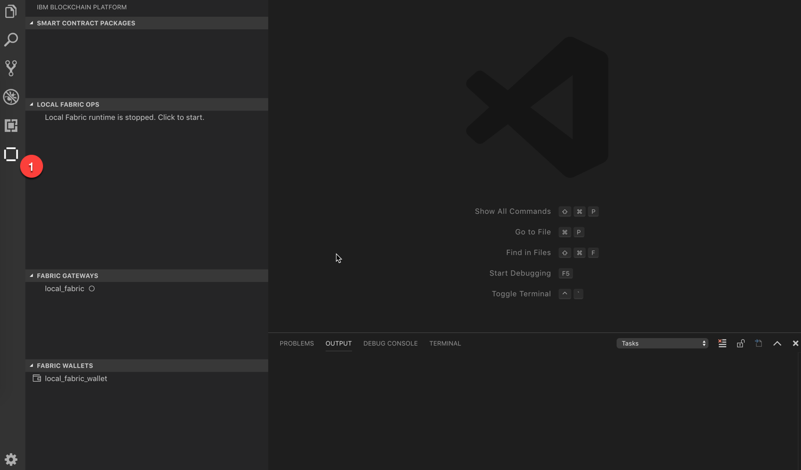
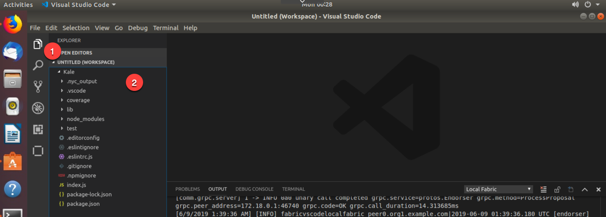
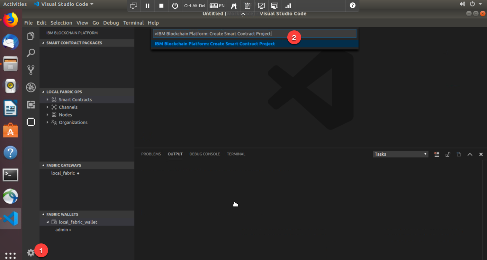
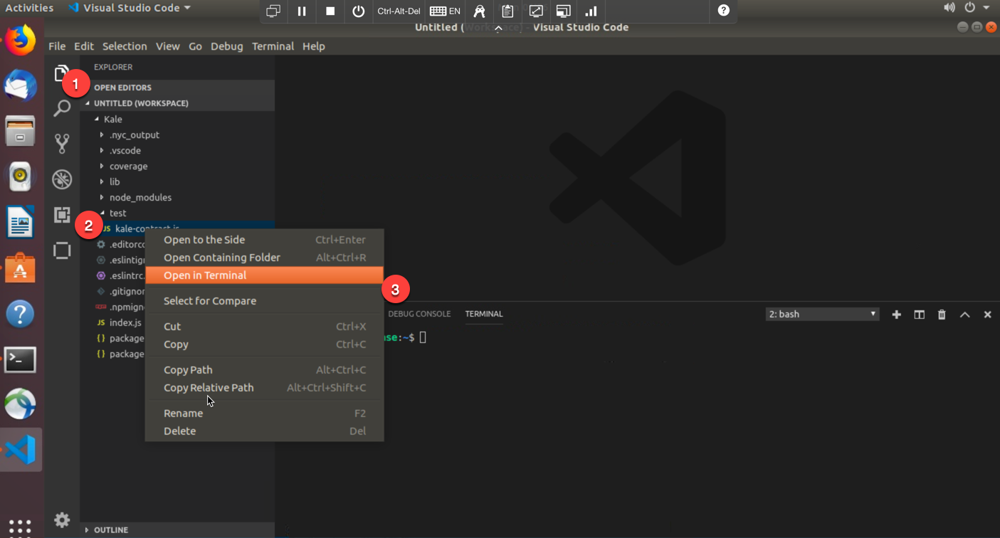
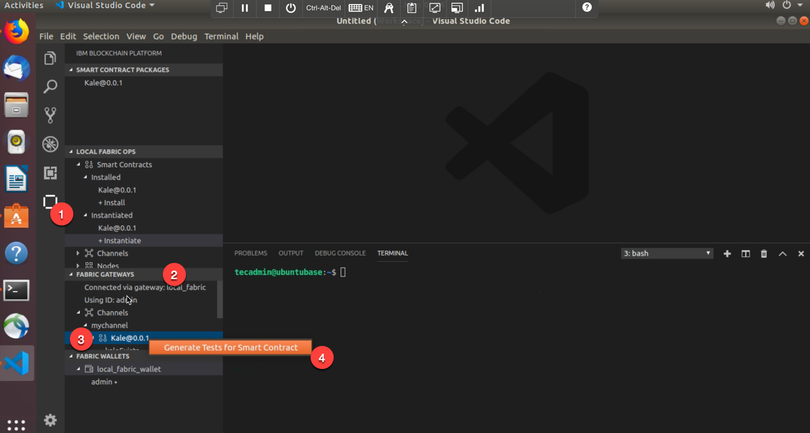

Section 1: Overview
===================

In this part of the lab, we will guide you through the steps for
generating, installing and instantiating a smart contract and then
testing that smart contract to verify that it works. Before all of that,
we will have you start up the local Hyperledger Fabric network so that
we can build our smart contract on top of it. In this lab, we have you
deploy to a local network that is running on your laptop, but you can
also connect the IBM Blockchain Platform VSCode Extension to either your
IBM Blockchain Platform network running in the IBM Cloud or your IBM
Blockchain Platform network running on your own premises. Below is a
breakdown of Part 1 of our lab:

-   Start up a Blockchain Network
    :      We must make sure that all levels of software (docker, node,
            npm, docker-compose and yo) are at the correct level before
            we start building our smart contract. Then, we will install
            the IBM Blockchain Platform Extension that will allow us to
            create and develop our smart contract. Once we have done
            that, we will then start up the Hyperledger Fabric network,
            which will consist of a certificate authority (CA), Solo
            orderer (meant for dev/test), couchdb (world state
            database), ccenv (chaincode environment), and most
            importantly our peer.

-   Create our Smart Contract
    :      Now that we have a running Hyperledger Fabric blockchain
            network, we will create our smart contract. The smart
            contract will be very basic in nature, but we will explain
            what the contract is trying to accomplish before we go
            through some of the unique features that the extension can
            do for us and our smart contract.

-   Package, Install and Instantiate our Smart Contract
    :      Since we have an understanding of how our smart contract
            works, we will need to install (peer level command) it on
            our peer and then instantiate (channel level command) the
            installed smart contract on the channel. Once we have
            instantiated the smart contract, we will be able to submit
            transactions.

-   Submit Transactions
    :      What fun is it to have a working smart contract and have it
            instantiated across the channel, if we can't submit
            transactions? In this section, we will actually submit
            transactions from the UI of VSCode. We will see data get
            committed to the ledger.

-   Tests
    :      Once we have an instantiated smart contract on our channel,
            we will then test out the code to make sure that the
            contract will actually work when we submit transactions.
            This checks all the files within our smart contract and
            simulates all of our transactions. We will know we are
            cooking with gas when our test comes back successful. We
            will then generate a test file that will test our smart
            contract, while submitting transactions to the ledger. We
            will view the docker logs of our running smart contract and
            see the transactions being added to the logs as well as the
            ledger.

Section 2: Start Up a Blockchain Network
========================================

**NOTE:** For Part 1 of our lab, we will be using the terminal within
VSCode. Do **not** execute the commands within the actual terminal
application. You can enter them from the terminal application, but the
instructions below will all be within the VSCode terminal. In Part 2 of
this lab, you will use the terminal application.

**1.** Open up your teminal and type in the following commands below :

    tecadmin@ubuntubase:~$ node -v # We want Node to be v8.x or higher
    v8.11.3
    tecadmin@ubuntubase:~$ npm -v # We want NPM to be v5.x or higher
    5.6.0
    tecadmin@ubuntubase:~$ yo --version # We want yo to be v2.x or higher
    2.0.5
    tecadmin@ubuntubase:~$ docker --version # We want Docker to be v17.06.2-ce or higher
    Docker version 17.06.2-ce, build cec0b72
    tecadmin@ubuntubase:~$ docker-compose --version # We want Docker Compose to be v1.14.0 or higher
    docker-compose version 1.14.0, build c7bdf9e
    tecadmin@ubuntubase:~$ 

If you get a version that doesn't support our qualifications, raise your
hand and tell the instructor.

**2.** From the Ubuntu Desktop, click on Visual Studio Code. The Visual
Studio Code icon is on the right above the `Cisco Anyconnect` icon on
the toolbar on the left.

**3.** Once you are in the Visual Studio Code application, you should
see an outline of a block just below the extensions button
(approximately the 6th button in VSCode). Go ahead and click on that
button. Once you do, you'll see a similar screen as the image below

**4.** Hover your mouse over the `Local Fabric Ops` panel and we'll see
three dots - `...` - and click on those dots. We'll be presented with
two options. `Start Fabric Runtime` and `Teardown Fabric Runtime` are
those two options. We will want to click on `Start Fabric Runtime` in
this case.

This will start our local Hyperledger Fabric network. It will stand up a
peer, certificate authority, orderer and a couchdb container. In
addition to standing up these containers, it will join our peer to a
channel called mychannel.

The difference between `Start Fabric Runtime` and
`Teardown Fabric Runtime` might be obvious, but `Start Fabric Runtime`
grabs all of the Hyperledger Fabric images and starts them as
containers. In addition, it builds the crypto material (certificates,
public and private keys) and creates and joins a sample channel called
`mychannel`. The other option, `Teardown Fabric Runtime` basically
cleans up the network and removes all of the containers that
`Start Fabric Runtime` builds. It does not remove the Hyperledger Fabric
images that the `Start Fabric Runtime` pulls down into your local docker
registry. To do a full cleanup, we will need to manually remove those
images.

**5.** How do we know if we have a successful blockchain network up and
running? I'm glad you asked! We will see messages flooding the `Output`
panel. We will want to see a message that resembles the one below :

    [2/20/2019 7:26:54 PM] [INFO] 2019-02-21 00:26:34.756 UTC [cli.common] readBlock -> INFO 002 Received block: 0
    [2/20/2019 7:26:54 PM] [INFO] 2019-02-21 00:26:34.930 UTC [channelCmd] InitCmdFactory -> INFO 001 Endorser and orderer connections initialized
    [2/20/2019 7:26:55 PM] [INFO] 2019-02-21 00:26:35.458 UTC [channelCmd] executeJoin -> INFO 002 Successfully submitted proposal to join channel

**6.** We can verify that everything is up and working by entering the
`docker ps -a` command that will print out all of our
containers.

Section 3: Create our Smart Contract
------------------------------------

Now that we have a local running Hyperledger Fabric network, let's
create our Smart Contract that we will then install and instantiate onto
our network.

**1.** We can do that by clicking on the gear icon in the bottom left
and then clicking on `Command Palette..` This will give us the option to
do a series of commands, some that are VSCode-related and some that are
IBM Blockchain Platform-related.

**2.** You will notice a series of commands pop up. Go ahead and enter
this command below into the search bar :

    >IBM Blockchain Platform: Create Smart Contract Project 

This command will generate a skeleton smart contract for us. We will
walk through all that it generates in a second.

**3.** We might get a message that says the text below. If we don't,
proceed onto the next step. :

    Can this extension install missing npm packages before proceeding?

Select `yes` if that message comes up. What it is installing is
`generator-fabric` which is actually the generator that creates our
skeleton smart contract.

**4.** We'll then get a message that says :

    Chose smart contract language (esc to cancel)

Choose `JavaScript` as our smart contract language of choice

**5.** The next prompt will ask you
`Name the type of asset managed by this smart contract`. You can put
whatever you would like to name your asset. For the sake of this lab
experience, I will name my asset `kale`.

**6.** Then it will, simply, say `Browse`. That implies that it is
looking for a folder to store the simple smart contract. Click on
`Browse` and then go to your `Desktop` and click on the blank folder on
the far right. There create and name a new folder and click on `Create`.
Then hit on `Save`.

**7.** Then it will ask `Choose how to open your new project` and just
click on `Add to workplace`.

**8.** If you click on the `Explorer` icon in the top left of VSCode,
you'll see the Kale folder in there with a lot more files

**9.** Go ahead and untoggle the `Kale` folder and then untoggle the
`lib` folder, in which you'll find the `kale-contract.js` file. Go ahead
and click on that to open it up. Below is a breakdown of this simple
smart contract:

The line of code below will bring into scope a key Hyperledger
Fabric class that will be used extensively by the smart contract --
Contract :

    const { Contract } = require('fabric-contract-api');

Below, we define the smart contract class KaleContract based on the
built-in Fabric Contract class. The methods which implement the key
transactions are defined within this class :

    class KaleContract extends Contract {

Below, the function is called createKale and it takes kaleId and a
value, both of which are strings. When this transaction is submitted, a
new asset will be created, with key kaleId and value value. For example
if we were to create "001", "A bunch of kale", then when we later read
the value of key 001, we'll learn the value of that particular state is
"A bunch of kale" :

    async createKale(ctx, kaleId, value) {
        const exists = await this.kaleExists(ctx, kaleId);
        if (exists) {
            throw new Error(`The kale ${kaleId} already exists`);
        }
        const asset = { value };
        const buffer = Buffer.from(JSON.stringify(asset));
        await ctx.stub.putState(kaleId, buffer);
    }

You'll often hear such transactions, like below, referred to as
"queries". As you can see, this function only takes kaleId, and will
return the value of whatever state that key points to. :

    async readKale(ctx, kaleId) {
        const exists = await this.kaleExists(ctx, kaleId);
        if (!exists) {
            throw new Error(`The kale ${kaleId} does not exist`);
        }
        const buffer = await ctx.stub.getState(kaleId);
        const asset = JSON.parse(buffer.toString());
        return asset;
    }

Take a look at the other transactions in the contract at your leisure,
then when you're happy, let's move on to packaging and deploying that
contract so that we can start using it...

Section 4: Package, Install and Instantiate our Smart Contract
==============================================================

**1.** Jump back down to the IBM Blockchain Platform section (the
outline of a block icon). From there, click on the gear button in the
bottom left and click on `Command Palette...`. Once it gives you a
prompt in the top, enter the text that is below :

    >IBM Blockchain Platform: Package a Smart Contract Project

**2.** Then it will bring in the <Kale@0.0.1> package into our
`Smart Contract Packages` section. If you had multiple folders open in
your `Editior` perspective, it would ask you for which folder to
package, but since there is only 1 it will grab the `Kale` folder.

**3.** Now, within the `Local Fabric Ops` section, you can untoggle
`Smart Contracts` and then click on `+Install`.

**4.** It will ask you `Choose which package to install on the peer` and
select `Kale@0.0.1`. Then it will go ahead and install it for you on
your peer.

**5.** Now that we have an installed smart contract, we need to
instantiate it. You can do that by, you might have guessed, clicking on
the `+Instantiate` button. Then it will ask you
`Choose a Smart Contract and Version to instanitate` and you can select
`Kale@0.0.1`. It will pop up another prompt asking you which function
you want to call. You can just hit the `Enter` key and bypass this
prompt. Then it will ask if you want to
`Provide a Private Data collection configuration file` and you can
select `No`. Then it will instaniate our `Kale` smart contract to our
channel, called `mychannel`.

Section 5: Submit Transactions
==============================

**1.** From the IBM Blockchain Platform Extension, you can click on the
`local_fabric` gateway. It will then use the `admin` ID. It will display
all of your channels that this gateway can see, in this case it is only
`mychannel`. If you untoggle `mychannel` you will see `Kale@0.0.1` as an
instantiated smart contract on the channel. If you had multiple smart
contracts on here, you would see those as well. Now, if you untoggle
`Kale@0.0.1` you will see the various transactions you can execute.

**2.** From this perspective, you can right click on `createKale` and
then click on `Submit Transaction`. Then it will prompt you for the
argurments you want to pass in. You can enter the text below. It will
give you another prompt for transient data, but you can hit enter to
bypass this prompt and it will then execute the transaction. **NOTE:**
Put your arguments between the brackets:

    "001", "a bunch of kale"

See what I did there? Anyways..

**3.** Now we can confirm that the transaction actually occured. There
are a couple of ways we could do this. The first way we can test this
out is by entering the following text below in our VSCode terminal:

    docker logs fabricvscodelocalfabric_peer0.org1.example.com | grep block
    *
    *
    2019-06-11 14:36:33.321 UTC [gossip.privdata] StoreBlock -> INFO 0a1 [mychannel] Received block [3] from buffer
    2019-06-11 14:36:33.322 UTC [committer.txvalidator] Validate -> INFO 0a2 [mychannel] Validated block [3] in 0ms
    2019-06-11 14:36:33.432 UTC [kvledger] CommitWithPvtData -> INFO 0a3 [mychannel] Committed block [3] with 1 transaction(s) in 109ms (state_validation=11ms block_commit=70ms state_commit=11ms)

**4.** The other option would be to right click on the `readKale`
transaction in the `Fabric Gateway` section. Once you right click on
`readKale` you can select `Evaluate Transaction`, which doesn't actually
get recorded as a transaction, but rather as a query. If you select
`Submit Transaction`, that would be recorded as a transaction. Once it
gives you a prompt, enter the text below. Then hit `enter` and then
`enter` again to bypass the transient data prompt and execute the query:

    "001"

    Output Logs:
    [6/11/2019 2:37:11 PM] [INFO] submitting transaction readKale with args 001
    [6/11/2019 2:37:13 PM] [SUCCESS] Returned value from readKale: {"value":"a bunch of kale"}

**5.** We can also update our Kale by right clicking on the `updateKale`
transaction and selecting `Submit Transaction`. You can enter the text
below to update our existing kale. Again, hit `enter` to go to the next
prompt and then `enter` again to bypass the transient data prompt and
execute our transaction:

    "001", "a bunch of organic kale"

**6.** Now, we can repeat step 4 and execute the `readKale` transaction.
This time, select `Submit Transaction` instead of
`Evaluate Transaction`. Here is what to enter in the prompt:

    "001"

     Output Logs:
    [6/11/2019 2:42:56 PM] [INFO] evaluateTransaction
    [6/11/2019 2:43:01 PM] [INFO] evaluating transaction readKale with args 001
    [6/11/2019 2:43:01 PM] [SUCCESS] Returned value from readKale: {"value":"a bunch of organic kale"}

**7.** Because Barry is on a major health kick and is hungry for some
organic Kale, we can execute the `deleteKale` transaction after Barry transforms the Kale into its base nutrients fighting for attention along with everything else in his bloodstream. To do this,
right click on the `deleteKale` transaction and enter this between the
brackets. Hit `enter` to go to the next prompt and then `enter` once
more to actually execute the transaction:

    "001"

**8.** To confirm that it is actually deleted, you can execute the
`readKale` transaction once more. Once you do that, you'll get an error
message in the bottom right. Those errors talk about endorsement failure
or no peers are available to be queried, but the real issue is that
there is no kale with an ID of `001`

Section 6: Tests
================

**1.** VSCode gives us a couple ways to test our smart contract. We will
test them both, but let's focus on unit testing first.

**2.** If you go to the `Editior` perspective, untoggle the `test`
folder. Then right click on the `kale-contract.js` file and select
`Open in terminal`.

**3.** Once you get your terminal prompt, enter the text below to test
our smart contract out:

    tecadmin@ubuntubase:~/Documents/Kale/tests$ npm test

    Output Logs:
     KaleContract

    #kaleExists
    ✓ should return true for a kale
    ✓ should return false for a kale that does not exist
    #createKale
    ✓ should create a kale
    ✓ should throw an error for a kale that already exists
    #readKale
    ✓ should return a kale
    ✓ should throw an error for a kale that does not exist
    #updateKale
    ✓ should update a kale
    ✓ should throw an error for a kale that does not exist
    #deleteKale
    ✓ should delete a kale
    ✓ should throw an error for a kale that does not exist

    10 passing (334ms)

    =============================== Coverage summary ===============================
    Statements : 100% ( 29/29 )
    Branches : 100% ( 10/10 )
    Functions : 100% ( 5/5 )
    Lines : 100% ( 29/29 )

You should get all green signs with some check marks. That is a good
sign that transactions should work as they are. Very nice!

**4.** Another way we can test is by generating a smart contract test
client. To do that, jump back down to the IBM Blockchain Platform
Extension by clicking on the outline of a block. Once you are there,
`right click` on your smart contract that is in your `Fabric Gateway`
section. Then select your only option,
`Generate Tests for Smart Contract`. Then select `JavaScript` once it
prompts you for which test language you prefer.

**5.** Then it will install some npm packages for us. You should see
some messaging in the bottom right. Once that is done, scroll down to
`line 72` in the file that was generated.

**6.** On `line 74`, enter the following within the brackets:

    "001", "a new bunch of kale"

**7.** Then save this file by either doing `Control + s` or by doing
`File -> Save`. Once you have done that, there should be a button that
says `Run Test` in between lines 71 and 72. You can click on `Run Test`
to actually run the test:

    Output Logs:
    KaleContract-Kale@0.0.1
    ✓ createKale (2352ms)

    1 passing (3s)

**8.** All the other transactions will work as well, but you will need
to save the file before trying to run the tests. Please try a few of the
tests for yourself.
