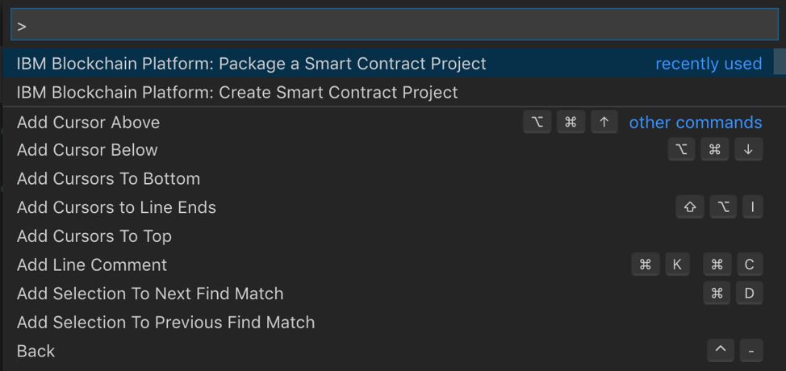
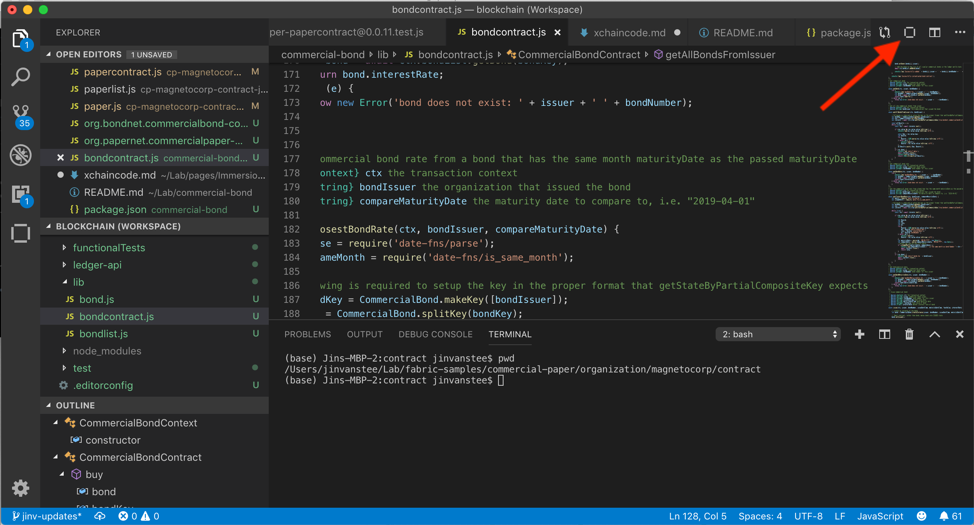
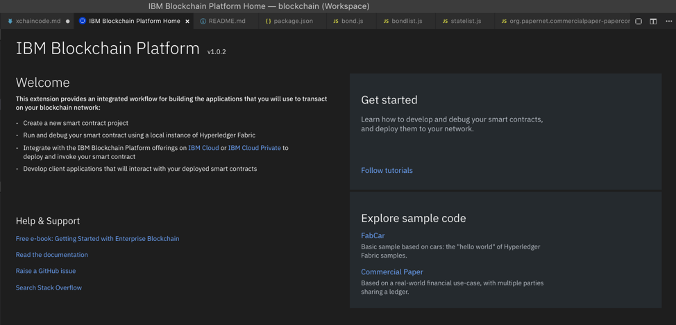
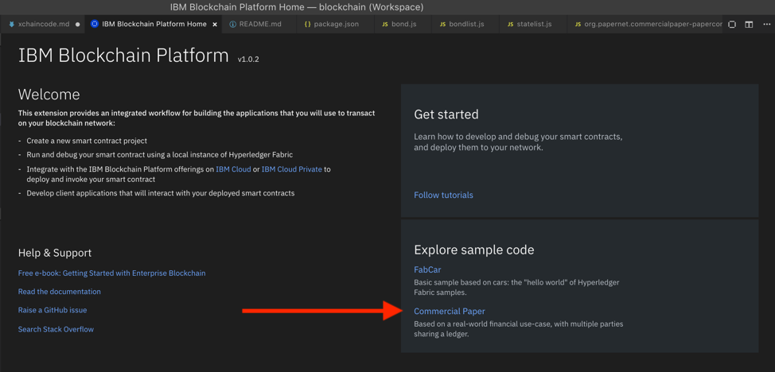
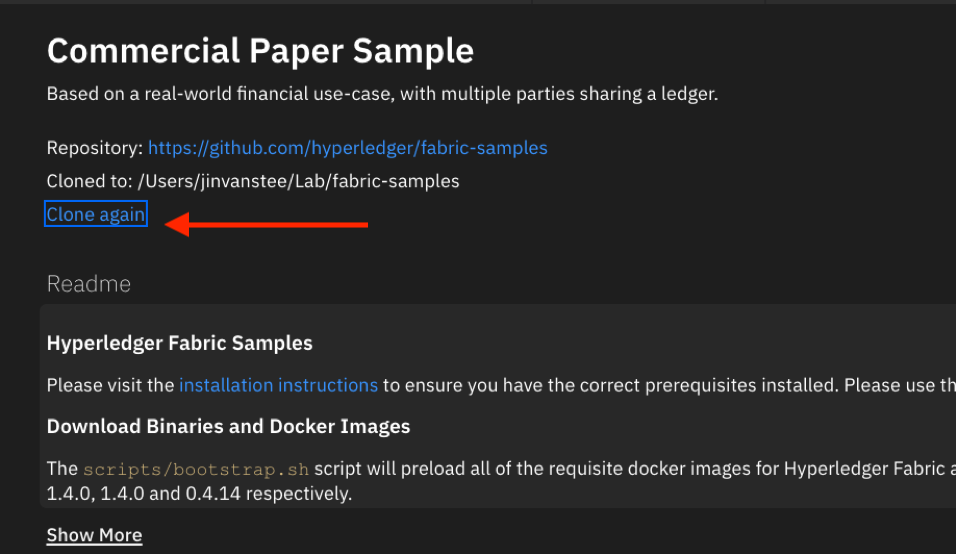
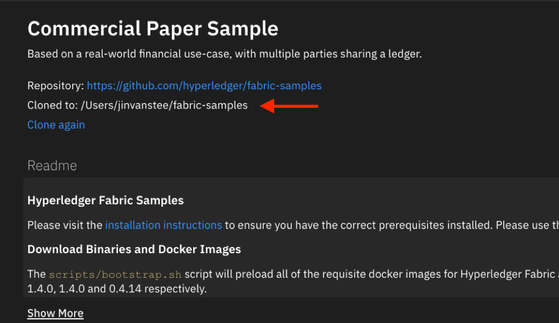
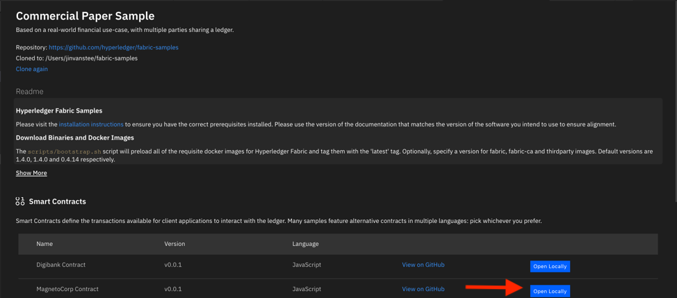
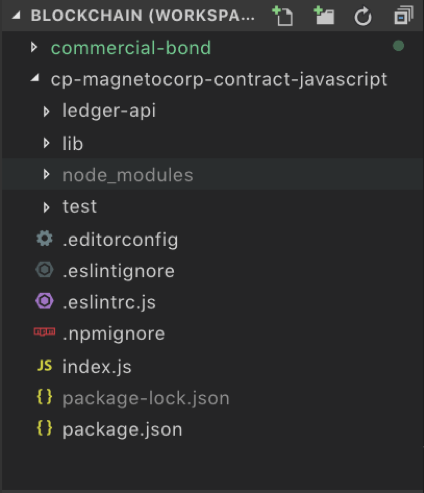

# VSCode Lab Part 3 - Cross Chaincode calls

You can use a chaincode to invoke other chaincodes. This allows a chaincode to query and write to data outside of its namespace. A chaincode can both read and update data outside of its namepace by using chaincode that is instantiated on the same channel. However, a chaincode can only query data by using chaincode on different channels.

Chaincode to chaincode interactions can be very useful if you are looking to integrate business logic at the chaincode level or for migration purposes. The goal of this lab is to show you how to code cross chaincode calls in a smart contract. The API that is used for doing this is the invokeChaincode() API from the fabric-shim library’s ChaincodeStub class. The invokeChaincode() API is a lower-level Fabric API that can be invoked through the higher-level Fabric API that you have been using in the previous labs.

Part of the cross chaincode process is to understand how and where you want to code the chaincode to chaincode interaction. In this lab, we add a new smart contract commercial-bond that we want commercial-paper to query. We want to simulate the situation when a commercial-paper is issued, the commercial-paper smart contract queries the commercial-bond contract for current returns on bonds with a similar maturity date, and sets the paper price accordingly. For more details on this particular use case, see the scenario described here: https://hyperledger-fabric.readthedocs.io/en/release-1.4/developapps/chaincodenamespace.html#cross-chaincode-access.

For this lab commercial-bond is already written and packaged up for you. You will clone and add the package to your VSCode IBM Blockchain Platform Extension. Then you will package, install and instantiate the contract to your locally running fabric environment. The instantiate process will also add a few sample bonds to the ledger and to commercial-bond's world state. This way your commercial-paper will have existing bonds to query and extract rates from. You can also experiment with commercial-bond's functions by issuing your own bonds.

The bulk of the lab will be done against the existing commercial-paper. This is where you will add additional functions that interact with the commercial-bond contract. We will also use the VSCode IBM Blockchain Platform Debug Smart Contract function so you get an understanding of how to quickly iterate through changes to a smart contract and debug a smart contract.

Finally we will deploy the bond-query-enabled commercial-paper to your local fabric, generate some functional tests, and run through them to make sure that the smart contract is functional.

These are the general steps you will take:
1. Clone the commercial-bond smart contract package and add package to VSCode workspace
2. Package commercial-bond, install and instantiate
3. Run a few tests to get familiar with commercial-bond
4. Grab commercial-paper if you don't already have it
5. Debug Smart Contract in Development Mode
6. Make additional code changes, test in debugging session
7. Make final updates. Package commercial-paper, install and instantiate
8. Generate function tests, and run through function tests
9. The end!


## Clone the commercial-bond smart contract package

Open up your terminal and run the following commands from your home directory:

`
$ git clone https://github.com/jinvanstee/commercial-bond.git
`

Sample output:
```
Cloning into 'commercial-bond'...
remote: Enumerating objects: 32, done.
remote: Counting objects: 100% (32/32), done.
remote: Compressing objects: 100% (28/28), done.
remote: Total 32 (delta 3), reused 31 (delta 2), pack-reused 0
Unpacking objects: 100% (32/32), done.
```

Return to your VSCode Explorer and add the commercial-bond smart contract folder to your workspace.

Right click anywhere in your workspace to get the drop down and select Add Folder to Workspace. Then browse to `<path to commercial-bond>/organization/magnetocorp/` and select contract and click Add.


You should see the contents of the contract folder in your workspace, like the following picture:
(Please note that your other folders may look different than the screen shot below, but the contents within the contract folder should be the same)


## Package commercial-bond, install and instantiate

In VSCode, open up the Command Palette (either by click on the gear icon to the lower left and selecting Command Palette or pressing `Command + Shift + P` if you are on a Mac and `Ctl + Shift + P` if you are on Linux). 

Select `IBM Blockchain Platform: Package a Smart Contract Project`:



Then select `commercial-bond`.


Upon success, you will see in the lower right corner a message like this:


Now you will install this chaincode to your local-fabric. Navigate to the IBM Blockchain Platform view in VSCODE (the 6th button down from the left menu):


Under the `Local Fabric Ops` panel, click on `+ Install`, then select `commercial-bond@0.0.1` from the list:


Upon success, you will see a message similar to the following in the lower right corner of VSCode:


You will also see the package listed under `Installed` in the `Local Fabric Ops` panel:


Now you will instantiate the installed contract. In the `Local Fabric Ops` panel, select `+ Instantiate`. In the pop-up, similar to when you installed the smart contract, select `commercial-bond@0.0.1`.

Next, type `instantiate` when it asks you What function do you want to call. Press `Enter` to continue:


Next, it will ask you what arguments to pass to the function. Just hit `Enter` here because there aren't arguments here.

Finally, it will ask you to provide a private data collection configuration file. Again, just hit `Enter` here because private data collection doesn't apply in this case.

First time initialization of Node.js chaincode can take a while because it will need to pull down all the Node dependencies from the npm registry. After a few minutes, upon success, you will see a success message in the lower right corner of VSCode:


Now that you have instantiated commercial-bond on your locally running fabric, you can...

## Run a few tests to get familiar with commercial-bond

VSCode IBM Blockchain Platform extension makes it easy for you to test out functions of your smart contract directly inside VSCode. Let's run a few tests directly through the functions made visible in the `Fabric Gateways` panel of the IBM Blockchain Platform view. Click on all the twisties to reveal the functions of commercial-bond:


Scroll down to see all the functions of this smart contract:


All of these functions represent transactions in this smart contract. Now, let's evaluate a few transactions.

Let's start with `getAllBondsFromIssuer` which will return all the bonds from a specified issuer.

Select the function `getAllBondsFromIssuer`, and either `right-click` or `Ctl+click` and select `Evaluate Transaction`:


Next, you will see a familar pop-up at the top of VSCode that asks you what are the arguments to the transaction. This transaction only takes one argument, and that is the name of the issuer. Let's type in "MagentoCorp" as follows (important to leave the double quotes):


Next, it will ask you what transient data to pass for the transaction. In this case we have none, so just press `Enter` to move forward.

Now, in the `OUTPUT` view, you will see the results of evaluating this transaction. And you will see that there are two bonds issued by MagnetoCorp:


Study the output and you will see other key/value pairs for each bond such as `maturityDateTime`, `issuer`, and `interestRate`.

A quick exercise, what is the `interestRate` for bondNumber 00002?

Now, let's issue a bond. This time we will submit the transaction so it actually gets committed to the ledger. 

In the `Fabric Gateways` panel, select the `issue` transaction. Either `right-click` or `Ctl+click` and select `Submit Transaction`.


Next, copy and paste the following inside the brackets when the pop-up asks you what are the arguments to the transaction:

`"MagnetoCorp", "00003", "2019-02-28", "2020-02-28", "50000","0.01"`


Hit `Enter` and next you will see the screen that asks you for transient data. Hit `Enter` here because we don't have any transient data in this case.

Then the transaction will get submitted. Upon success, you will see in the `OUTPUT` panel the following. Notice the `[SUCCESS]` message which means the transaction was successfully submitted.


The actual output to the issue command isn't very helpful as it is just a buffer of numbers that represent the bond. Let's re-run the `getAllBondsFromIssuer` and see if this bond shows up. Use the steps from above to re-run this transaction. Upon success, you will see the following output, and notice that the bond we just added shows up now:


Now, the last transaction for you to test, is the `getClosestBondRate` transaction. This is the transaction that we will update commcercial-paper to call. This transaction takes two arguments: 1) bondIssuer and 2) compareMaturityDate. And what this transaction will do is iterate through all the bonds issued by the specified bondIssuer until it finds a bond that has a similar maturity date as the one passed through compareMaturityDate, and it will return that bond's interest rate. If it cannot find a bond with a similar maturity date it will return an empty string.

Select `getClosestBondRate` from the `Fabric Gateways` panel, and either `right-click` or `Ctl+click` and select `Evaluate Transaction`.


Next you will be asked what arguments to pass. Copy and paste the following inside the brackets:

`"MagnetoCorp","2020-02-15"`


Hit `Enter`. Again, you will be asked for transient data and again you will just hit `Enter` to progress forward to evaluating the transaction.

Upon success, you will see the following output in the `OUTPUT` panel:


Notice that the interest rate returned is 0.01, which if you recall is the interest rate associated with MagnetoCorp's bondNumber 00003, which has a maturity date of 2020-02-28 which is the same month as the 2nd argument you passed for `getClosestBondRate`.

Now run the same evaluation but with the following arguments:

`"MagnetoCorp","2020-04-30"`

What do you get returned?  Is it expected?  Which bond does the rate belong to?

Lastly, run the same evaluation but with the following arguments:

`"MagnetoCorp","2020-05-31"`

Now what do you get returned?  Is it expected?

# Get commercial-paper if you don't already have it

If you already have commercial-paper in VSCode from the previous lab, you can skip this section. If not, follow the steps below to get it into your VSCode workspace.

Let's use the IBM Blockchain Platform Extension sample home page to get the commercial-paper package. Click on the IBM Blockchain Platform Extension icon in the upper right corner of VSCode:



This will bring up the following page in VSCode:



Click on `Commercial Paper` in the Explore sample code section:



On the `Commercial Paper Sample` page, click on `Clone` (the picture below shows `Clone again` but if you are doing this for the first time it should just say `Clone`):



Now it will ask you where you want to clone the repository, pick a location on your workstation, and click `Clone Repository`.

When it is done cloning, you will see the location that you cloned to here:



Now, from the same `Commercial Paper Sample` page, go to the `Smart Contracts` section and select `Open Locally` for `MagnetoCorp Contract`:



In the pop-up window, select `Add to workspace`:


In your VSCode Explorer Blockchain workspace panel, you will see the following `cp-magnetocorp-contract-javascript` folder with its contents added:



Now you are ready to make updates to the smart contract and test them quickly by working in Hyperledger Fabric development mode in conjunction with the VSCode Debugger.

# Debug Smart Contract in Development Mode


